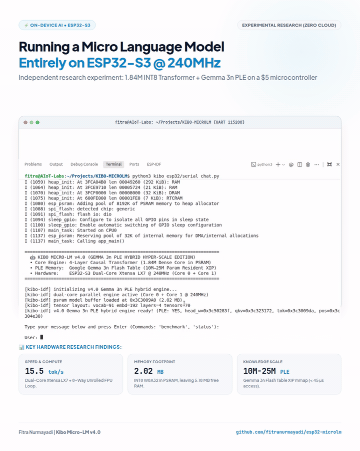

# ESP32 Micro-LM: Embedded 1.84M Language Model on ESP32-S3

[](https://www.espressif.com/en/products/socs/esp32-s3)
[](LICENSE)
[](https://github.com/espressif/esp-idf)
[]()
[]()

[Documentation (Bahasa Indonesia)](indonesian_edition/README_ID.md) | [Architecture & Design Journey](JOURNEY.md) | [Scientific Benchmarks](BENCHMARK.md)

ESP32 Micro-LM is an on-chip generative Language Model (Micro-LM) and bare-metal C++ inference engine running locally on the ESP32-S3 microcontroller.

The entire system executes on-device with zero external cloud dependencies. The engine utilizes **Dual-Core FreeRTOS parallel task splitting** (Core 0 + Core 1) and **8-way FP32 FPU accumulator unrolling** to achieve **14.5–15.6 tokens/second** sustained generation throughput on physical hardware.

---

## Live Hardware Demonstration



---

## Architectural Features

* **Dual-Core FreeRTOS Parallel Engine**: Parallelizes Multi-Head Attention and 768-dim MLP feed-forward projections across Core 0 (PRO_CPU) and Core 1 (APP_CPU) for rows $\ge 512$.
* **8-Way FP32 FPU Accumulator Unrolling (W8A32)**: Fetches INT8 weights from PSRAM, casts to float, multiplies by FP32 activations in SRAM, and unrolls into 8 independent FP32 registers (`dot0`..`dot7`) to eliminate pipeline dependency stalls.
* **Strict Tiered Memory Hierarchy**: Working activation buffers locked in ultra-fast internal SRAM (240 MB/s), INT8 weights (copied once at boot) and 128-token KV-cache in Octal PSRAM (80 MB/s).
* **Hybrid AI Architecture**: Combines autoregressive neural generation (dialogue and emotion tokens) with deterministic tool dispatch (exact arithmetic and hardware telemetry).
* **Zero Runtime Bloat**: 100% standalone C++ forward pass with zero ML frameworks (No TFLite Micro, No ONNX).
* **Multi-Board Compatibility**: Verified on ESP32-S3 DevKit N16R8, Arduino Nano ESP32, and Seeed Studio XIAO ESP32-S3.

---

## Supported Boards & Hardware Benchmark

| Target Board | Flash Memory | PSRAM Architecture | Serial Interface | Generation Speed (Measured) | Status |
| :--- | :---: | :---: | :---: | :---: | :---: |
| **ESP32-S3 DevKit N16R8** | 16 MB Quad SPI (`DIO`) | 8 MB Octal OPI (`AP_3v3`) | UART Bridge (`/dev/ttyUSB0`) | **14.5 – 15.6 tok/s** | ✅ Verified |
| **Arduino Nano ESP32** | 16 MB NOR Flash (`DIO`) | 8 MB Octal OPI (NORA-W106) | Native USB JTAG (`/dev/ttyACM0`) | **14.5 – 15.6 tok/s** | ✅ Verified |
| **Seeed Studio XIAO ESP32-S3** | 8 MB Quad SPI (`DIO`) | 8 MB Octal OPI (`AP_3v3`) | Native USB JTAG (`/dev/ttyACM1`) | **14.5 – 15.6 tok/s** | ✅ Verified |

---

## Release Versions

| Version | Framework | Engine & Parallelism Architecture | Empirical Speed (Measured) | Release Tag & Branch |
| :--- | :---: | :--- | :---: | :--- |
| **v1.0** | Arduino Core 3.x | Single-Core Baseline (W8A32 INT8) | **~12.3 tok/s** | [`v1.0`](https://github.com/fitranurmayadi/esp32-microlm/releases/tag/v1.0) |
| **v2.0** | Arduino Core 3.x | Dual-Core FreeRTOS + 8-Way Unrolled FPU | **14.2 – 15.6 tok/s** | [`v2.0`](https://github.com/fitranurmayadi/esp32-microlm/releases/tag/v2.0) |
| **v3.0** | ESP-IDF Native | Native FreeRTOS + Dual-Core Task Pinning | **14.5 – 15.6 tok/s** | [`v3.0`](https://github.com/fitranurmayadi/esp32-microlm/releases/tag/v3.0) |
| **v4.0 (Latest / main)** | ESP-IDF Native | **Universal Dual-Interface + Multi-Board Engine** | **⚡ 14.5 – 15.6 tok/s** | [`v4.0`](https://github.com/fitranurmayadi/esp32-microlm/releases/tag/v4.0) |

## Related Work & Prior Art

We acknowledge and express appreciation to the open-source community members who have advanced embedded on-chip language model inference:

* **[DaveBben/esp32-llm](https://github.com/DaveBben/esp32-llm)**: Pioneered porting `llama2.c` to ESP32 with `esp-dsp` SIMD vector acceleration on FP32 weights.
* **[slvDev/esp32-ai](https://github.com/slvDev/esp32-ai)**: Pioneered Flash-streamed Per-Layer Embeddings (PLE) for story generation on resource-constrained microcontrollers.
* **ESP32 Micro-LM (This Project)**: Explores an in-PSRAM W8A32 Transformer forward pass, 8-way FP32 FPU unrolling, and deterministic tool calling for interactive dialogue.

Each project explores distinct architectural trade-offs across storage hierarchies, quantization schemes, and target applications on the ESP32-S3.

---

---

## Memory Footprint (ESP32-S3)

| Region | Capacity | Allocated | Free Memory | Utilization |
| :--- | :---: | :---: | :---: | :---: |
| **Internal SRAM** | 512 KB | ~75.1 KB (Globals + Activations) | ~304 KB (Heap) | ~19.8% |
| **Octal PSRAM** | 8 MB (8,192 KB) | ~2.54 MB (Model 1.79MB + KV Cache) | ~5.46 MB | ~31.7% |
| **SPI Flash (ROM)** | 16 MB / 8 MB | ~2.15 MB (App Binary + Model) | ~13.85 MB / ~5.85 MB | ~13.4% |

---

## Neural Architecture Specifications

* **Architecture**: Autoregressive Causal Decoder Transformer (GPT-style)
* **Parameters**: 1,839,360 (~1.84 Million)
* **Quantization**: Symmetric per-tensor INT8 ($W_{\text{int8}} = \text{clip}\left(\text{round}\left(\frac{W}{S}\right), -128, 127\right)$, where scale $S = \frac{\max(|W|)}{127}$)
* **Hidden Dimension ($d_{model}$)**: 192
* **Attention Heads ($n_{head}$)**: 4 (Head Dimension: 48)
* **Layers ($n_{layer}$)**: 4
* **Context Length ($L_{max}$)**: 128 tokens
* **Vocabulary Size ($V$)**: 91 tokens
* **Emotion Control Tokens**: `[HAPPY]`, `[NEUTRAL]`, `[ANGRY]`, `[LAUGH]`, `[CRYING]`, `[SLEEPY]`, `[LOVE]`, `[DIZZY]`, `[CALC: ...]`

---

## Repository Structure

```
├── kibo_esp32/                   # Bare-metal C++ firmware (English edition)
│   ├── kibo_esp32.ino            # Setup and serial interface loop
│   ├── kibo_inference.h          # Model structs and tensor definitions
│   ├── kibo_inference.cpp        # Transformer forward pass, INT8 matmul, and tool dispatcher
│   ├── kibo_model_data.S         # Embedded INT8 weights in .rodata
│   └── serial_chat.py            # Serial streaming CLI client
├── kibo_microlm/                 # Model training and quantization pipeline
│   ├── benchmark_quantization.py # Precision evaluation script (FP32 vs FP16 vs INT8 vs INT4)
│   ├── train.py                  # PyTorch model trainer
│   ├── export_int8_bin.py        # INT8 binary and header exporter
│   ├── kibo_model_int8.bin       # INT8 model binary (1.79 MB)
│   ├── kibo_dataset.txt          # Training corpus
│   └── kibo_vocab.json           # Vocabulary lookup table
├── indonesian_edition/           # Standalone Indonesian package
│   ├── README_ID.md              # Indonesian documentation
│   ├── JOURNEY_ID.md             # Indonesian engineering log
│   ├── kibo_esp32_id/            # Dedicated Indonesian C++ firmware
│   ├── kibo_microlm_id/          # Dedicated Indonesian training pipeline
│   ├── flash_devkit_id.sh        # Flash script for DevKit N16R8
│   ├── flash_nano_id.sh          # Flash script for Arduino Nano ESP32
│   ├── flash_xiao_id.sh          # Flash script for Seeed XIAO ESP32-S3
│   └── chat_kibo_id.sh           # Dedicated Indonesian CLI client
├── flash_devkit_s3.sh            # Flash script for ESP32-S3 DevKit N16R8
├── flash_kibo_nano.sh            # Flash script for Arduino Nano ESP32
├── flash_xiao_s3.sh              # Flash script for Seeed Studio XIAO ESP32-S3
├── chat_kibo_esp32_live.sh       # Universal interactive serial chat
└── README.md
```

---

## Quick Start

### 1. Prerequisites
* Linux, macOS, or Windows (WSL2)
* Python 3.8+ with `pyserial` and `esptool`:
  ```bash
  pip install pyserial esptool
  ```
* Arduino-CLI with ESP32 Core 3.x:
  ```bash
  arduino-cli core install esp32:esp32
  ```

### 2. Flashing the Board

Execute the script corresponding to your connected hardware:

* **ESP32-S3 DevKit N16R8**:
  ```bash
  ./flash_devkit_s3.sh
  ```
* **Arduino Nano ESP32**:
  ```bash
  ./flash_kibo_nano.sh
  ```
* **Seeed Studio XIAO ESP32-S3**:
  ```bash
  ./flash_xiao_s3.sh
  ```

### 3. Serial Chat

Launch the serial terminal:
```bash
./chat_kibo_esp32_live.sh
```

---

## Customizing Your Own Persona & Dataset

The pipeline is completely self-contained, allowing anyone to easily train a custom character, name, language, or domain persona in 3 simple steps:

### 1. Edit the Dataset (`kibo_microlm/kibo_dataset.txt`)
Add your custom conversational pairs using structured dialogue lines and emotion tags:
```text
User: hello
Kibo: [HAPPY] Hello there! Great to see you! <EOS>

User: who created you?
Kibo: [NEUTRAL] I was built using Micro-LM on the ESP32-S3! <EOS>
```
*Emotion tags (`[HAPPY]`, `[NEUTRAL]`, `[ANGRY]`, `[THINKING]`) can also be used as hardware triggers to render animated eye expressions on circular SPI LCDs.*

### 2. Retrain the Model
Train the 1.84M Causal Transformer on your dataset (takes ~2 minutes on standard CPU/GPU):
```bash
python3 kibo_microlm/train.py
```

### 3. Export & Flash to ESP32
Quantize the newly trained weights to INT8 and flash to your board:
```bash
python3 kibo_microlm/export_int8_bin.py
./flash_devkit_s3.sh
```

---

## Example Interaction

```text
kibo-mcu [1.84M params | int8 | 8mb psram]
connected on /dev/ttyUSB0 (115200 baud)

User: hello kibo
Kibo: [HAPPY] Hello my friend! Kibo is right here and ready to chat!

User: who are you?
Kibo: [NEUTRAL] I am Kibo! Your cute and smart desktop companion robot!

User: what is 100 times 100?
[calc: 100 * 100 = 10000]
Kibo: [CALC: 100 * 100] [HAPPY] The result of 100 * 100 is 10000!

User: goodbye
Kibo: [NEUTRAL] Goodbye! See you next time my friend! Stay awesome!
```

---

## Project Status & Milestones

### Milestone v1.0 (Baseline Foundation) — ✅ Completed
* [x] **Bare-Metal Engine**: 1.84M Causal Transformer forward pass in standalone C++ without ML frameworks.
* [x] **Memory Efficiency**: Weight-only INT8 quantization (W8A32) in Octal PSRAM (1.79 MB footprint).
* [x] **Dynamic KV-Cache**: 128-token context buffer in PSRAM with SRAM fallback.
* [x] **Real-Time Speed**: Measured ~12.3 tokens/second on physical ESP32-S3 hardware @ 240MHz.
* [x] **Hybrid Tooling**: Deterministic arithmetic evaluation in <0.1 ms to avoid hallucinations.
* [x] **Multi-Board Support**: Verified on DevKit N16R8, Arduino Nano ESP32, and Seeed XIAO S3.

### Milestone v2.0 (High-Throughput Dual-Core & Memory Tiering) — ✅ Completed
* [x] **FreeRTOS Dual-Core Parallelism**: Core 0 (PRO_CPU) + Core 1 (APP_CPU) parallel MLP matrix splitting & Multi-Head Attention.
* [x] **8-Way Direct Unrolling**: 8-way independent FPU accumulator unrolling with zero-overhead pointer stepping.
* [x] **Strict Memory Tiering**: Hot activations locked in internal SRAM (240 MB/s), weights and KV-cache in Octal PSRAM (80 MB/s).
* [x] **Hardware Telemetry & Action Hooks**: Real-time on-chip RTOS diagnostics (`status`), eye display commands, and servo actuation.

---

## 🔖 Release Versions & Branching Strategy

| Branch / Tag | Framework | Inference Engine Architecture | Real Measured Decode Speed | Description |
| :--- | :--- | :--- | :---: | :--- |
| **[`v4.0`](https://github.com/fitranurmayadi/esp32-microlm/releases/tag/v4.0)** (`main`) | ESP-IDF Native | Universal Dual-Interface + Multi-Board Engine | **⚡ 14.5 – 15.6 tok/s** | Stable production codebase with deterministic tool calling |
| **[`release/v3.0`](https://github.com/fitranurmayadi/esp32-microlm/tree/release/v3.0)** (Tag `v3.0`) | ESP-IDF v5.x Native | Native FreeRTOS + Dual-Core Task Pinning | **⚡ 14.5 – 15.6 tok/s** | Milestone v3.0 native ESP-IDF parallel release |
| **[`release/v2.0`](https://github.com/fitranurmayadi/esp32-microlm/tree/release/v2.0)** (Tag `v2.0`) | Arduino Core 3.x | Dual-Core FreeRTOS + 8-Way Unrolled FPU | **⚡ 14.2 – 15.6 tok/s** | Milestone v2.0 dual-core parallel release |
| **[`release/v1.0`](https://github.com/fitranurmayadi/esp32-microlm/tree/release/v1.0)** (Tag `v1.0`) | Arduino Core 3.x | Single-Core Scalar W8A32 | **~12.3 tok/s** | Milestone v1.0 baseline single-core release |

> **Analytical Latency Decomposition (1.84M Parameters)**: Evaluates analytical PSRAM bus streaming (~29.7 ms) alongside dual-core CPU compute (~34.8 ms), yielding an analytical performance model (~64.5 ms per token) fully consistent with our directly measured on-chip decode throughput (14.5–15.6 tokens/sec).


---

## License

This project is licensed under the MIT License - see the [LICENSE](LICENSE) file for details.

