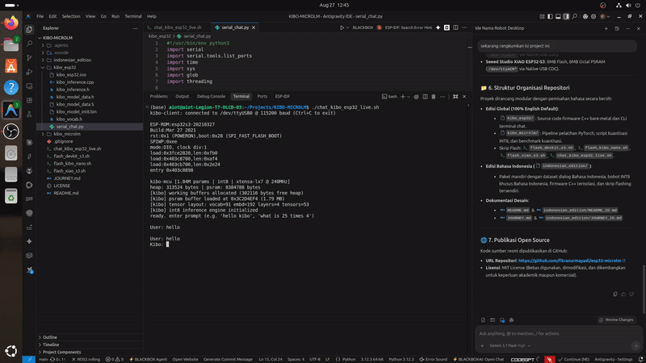

# Kibo: Embedded Micro-LM & Hybrid AI on ESP32-S3

[](https://www.espressif.com/en/products/socs/esp32-s3)
[](LICENSE)
[](https://github.com/espressif/arduino-esp32)
[]()
[]()

[Documentation (Bahasa Indonesia)](indonesian_edition/README_ID.md) | [Architecture & Design Journey](JOURNEY.md)

Kibo is an on-chip generative Micro Language Model (Micro-LM) and hybrid inference engine written in bare-metal C++ for the ESP32-S3 microcontroller.

The entire system executes locally on-device without cloud connections, external servers, or network access. All operations—including INT8 matrix multiplication, dynamic key-value (KV) caching, and hardware ALU arithmetic dispatch—run on the dual-core Xtensa LX7 processor at **~12–13 tokens/second** (~80 ms per token).

---

## Live Hardware Demonstration



> **Full Demonstration Video**: [`testing_video/ujicoba_kibo.mp4`](testing_video/ujicoba_kibo.mp4) (1080p @ 60 FPS live interactive UART terminal session running on physical ESP32-S3 hardware).

---

## Architectural Features

* **Bare-Metal C++ Transformer**: Standalone forward-pass implementation of a 4-Layer Causal Transformer (Self-Attention, LayerNorm, GeLU, INT8 MatMul, and dynamic KV-Cache) with zero dependency on runtime frameworks (no TFLite Micro or ONNX).
* **Hybrid AI Execution**: Merges autoregressive neural generation (persona dialogue and emotion control tokens) with deterministic hardware tool dispatch (ALU arithmetic evaluation in <0.1 ms).
* **Octal PSRAM Memory Layout**: Model weights (1.79 MB) and 128-token KV-cache are mapped into 80MHz Octal PSRAM (`AP_3v3`), avoiding SPI Flash access bottlenecks during forward passes.
* **Direct ROM Fallback**: Supports embedded `.rodata` execution and Flash memory mapping (MMAP).
* **Multi-Board Support**: Verified on ESP32-S3 DevKit N16R8, Arduino Nano ESP32, and Seeed Studio XIAO ESP32-S3.

---

## Supported Boards

| Target Board | Flash Memory | PSRAM Architecture | Serial Interface | Flash Script |
| :--- | :---: | :---: | :---: | :--- |
| **ESP32-S3 DevKit N16R8** | 16 MB Quad SPI (`DIO`) | 8 MB Octal OPI (`AP_3v3`) | UART Bridge (`/dev/ttyUSB0`) | [`flash_devkit_s3.sh`](flash_devkit_s3.sh) |
| **Arduino Nano ESP32** | 16 MB NOR Flash (`DIO`) | 8 MB Octal OPI (NORA-W106) | Native USB CDC (`/dev/ttyACM*`) | [`flash_kibo_nano.sh`](flash_kibo_nano.sh) |
| **Seeed Studio XIAO ESP32-S3** | 8 MB Quad SPI (`DIO`) | 8 MB Octal OPI (`AP_3v3`) | Native USB CDC (`/dev/ttyACM*`) | [`flash_xiao_s3.sh`](flash_xiao_s3.sh) |

---

## Quantization Benchmark (1.84M Parameters)

Empirical evaluation on the Kibo Causal Transformer across precision formats:

| Format | Weight Size | Compression | Logit Cosine Similarity | Memory & Execution Feasibility |
| :--- | :---: | :---: | :---: | :--- |
| **FP32** | 7.02 MB | Baseline (0.0%) | 100.00% | High memory footprint (~92% PSRAM allocation) |
| **FP16** | 3.51 MB | 50.0% | 100.00% | Software emulation required (No native FP16 ALU on Xtensa LX7) |
| **INT8 (Selected)** | **1.79 MB** | **74.4%** | **100.00%** | **Optimal: Direct 1-byte access, 100% semantic fidelity** |
| **INT4** | 0.88 MB | 87.2% | 98.87% | Degraded precision; +26% latency overhead from bit-unpacking |

---

## Memory Footprint (ESP32-S3)

| Region | Capacity | Allocated | Free Memory | Utilization |
| :--- | :---: | :---: | :---: | :---: |
| **Internal SRAM** | 512 KB | ~75.1 KB (Globals + Activations) | ~304 KB (Heap) | ~19.8% |
| **Octal PSRAM** | 8 MB (8,192 KB) | ~2.54 MB (Model 1.79MB + KV Cache) | ~5.46 MB | ~31.7% |
| **SPI Flash (ROM)** | 16 MB / 8 MB | ~2.15 MB (App Binary + Model) | ~13.85 MB / ~5.85 MB | ~13.4% |

---

## Neural Architecture Specifications

* **Architecture**: Autoregressive Causal Decoder Transformer (GPT-style)
* **Parameters**: 1,839,360 (~1.84 Million)
* **Quantization**: Symmetric per-tensor INT8 ($W_{int8} = \text{round}(W / S)$)
* **Hidden Dimension ($d_{model}$)**: 192
* **Attention Heads ($n_{head}$)**: 4 (Head Dimension: 48)
* **Layers ($n_{layer}$)**: 4
* **Context Length ($L_{max}$)**: 128 tokens
* **Vocabulary Size ($V$)**: 91 tokens
* **Emotion Control Tokens**: `[HAPPY]`, `[NEUTRAL]`, `[ANGRY]`, `[LAUGH]`, `[CRYING]`, `[SLEEPY]`, `[LOVE]`, `[DIZZY]`, `[CALC: ...]`

---

## Repository Structure

```
├── kibo_esp32/                   # Bare-metal C++ firmware (English edition)
│   ├── kibo_esp32.ino            # Setup and serial interface loop
│   ├── kibo_inference.h          # Model structs and tensor definitions
│   ├── kibo_inference.cpp        # Transformer forward pass, INT8 matmul, and tool dispatcher
│   ├── kibo_model_data.S         # Embedded INT8 weights in .rodata
│   └── serial_chat.py            # Serial streaming CLI client
├── kibo_microlm/                 # Model training and quantization pipeline
│   ├── benchmark_quantization.py # Precision evaluation script (FP32 vs FP16 vs INT8 vs INT4)
│   ├── train.py                  # PyTorch model trainer
│   ├── export_int8_bin.py        # INT8 binary and header exporter
│   ├── kibo_model_int8.bin       # INT8 model binary (1.79 MB)
│   ├── kibo_dataset.txt          # Training corpus
│   └── kibo_vocab.json           # Vocabulary lookup table
├── indonesian_edition/           # Standalone Indonesian package
│   ├── README_ID.md              # Indonesian documentation
│   ├── JOURNEY_ID.md             # Indonesian engineering log
│   ├── kibo_esp32_id/            # Dedicated Indonesian C++ firmware
│   ├── kibo_microlm_id/          # Dedicated Indonesian training pipeline
│   ├── flash_devkit_id.sh        # Flash script for DevKit N16R8
│   ├── flash_nano_id.sh          # Flash script for Arduino Nano ESP32
│   ├── flash_xiao_id.sh          # Flash script for Seeed XIAO ESP32-S3
│   └── chat_kibo_id.sh           # Dedicated Indonesian CLI client
├── flash_devkit_s3.sh            # Flash script for ESP32-S3 DevKit N16R8
├── flash_kibo_nano.sh            # Flash script for Arduino Nano ESP32
├── flash_xiao_s3.sh              # Flash script for Seeed Studio XIAO ESP32-S3
├── chat_kibo_esp32_live.sh       # Universal interactive serial chat
└── README.md
```

---

## Quick Start

### 1. Prerequisites
* Linux, macOS, or Windows (WSL2)
* Python 3.8+ with `pyserial` and `esptool`:
  ```bash
  pip install pyserial esptool
  ```
* Arduino-CLI with ESP32 Core 3.x:
  ```bash
  arduino-cli core install esp32:esp32
  ```

### 2. Flashing the Board

Execute the script corresponding to your connected hardware:

* **ESP32-S3 DevKit N16R8**:
  ```bash
  ./flash_devkit_s3.sh
  ```
* **Arduino Nano ESP32**:
  ```bash
  ./flash_kibo_nano.sh
  ```
* **Seeed Studio XIAO ESP32-S3**:
  ```bash
  ./flash_xiao_s3.sh
  ```

### 3. Serial Chat

Launch the serial terminal:
```bash
./chat_kibo_esp32_live.sh
```

---

## Example Interaction

```text
kibo-mcu [1.84M params | int8 | 8mb psram]
connected on /dev/ttyUSB0 (115200 baud)

User: hello kibo
Kibo: [HAPPY] Hello my friend! Kibo is right here and ready to chat!

User: who are you?
Kibo: [NEUTRAL] I am Kibo! Your cute and smart desktop companion robot!

User: what is 100 times 100?
[calc: 100 * 100 = 10000]
Kibo: [CALC: 100 * 100] [HAPPY] The result of 100 * 100 is 10000!

User: goodbye
Kibo: [NEUTRAL] Goodbye! See you next time my friend! Stay awesome!
```

---

## License

Distributed under the MIT License. See [`LICENSE`](LICENSE) for details.
