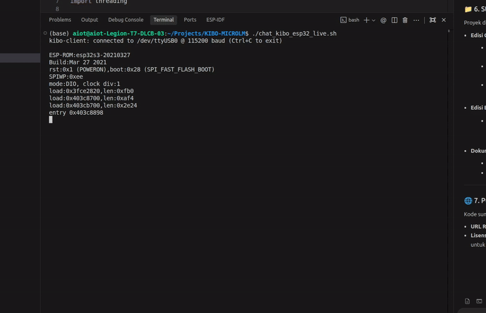

# Kibo: Micro Language Model (Micro-LM) & Hybrid AI di ESP32-S3 (Edisi Bahasa Indonesia)

[](https://www.espressif.com/en/products/socs/esp32-s3)
[](../LICENSE)
[](https://github.com/espressif/arduino-esp32)
[]()
[]()

[English Global Edition](../README.md) | [Dokumen Arsitektur & Perjalanan Teknis](JOURNEY_ID.md)

Kibo Edisi Bahasa Indonesia adalah paket mandiri dari model bahasa generatif mikro (Micro-LM) dan mesin inferensi berbasis C++ bare-metal yang berjalan secara lokal di mikrokontroler ESP32-S3.

Seluruh proses inferensi dieksekusi 100% on-device tanpa jaringan internet atau server eksternal. Perkalian matriks INT8, dynamic KV-cache, dan evaluasi kalkulator hardware dijalankan langsung pada prosesor Xtensa LX7 dual-core dengan kecepatan **~12–13 token/detik** (~80 ms per token).

---

## Demonstrasi Nyata di Hardware ESP32-S3



> **Video Demonstrasi Lengkap**: [`../testing_video/ujicoba_kibo.mp4`](../testing_video/ujicoba_kibo.mp4) (Sesi live UART terminal 1080p @ 60 FPS langsung di ESP32-S3 DevKit N16R8).

---

## Fitur Arsitektur

* **Transformer C++ Bare-Metal**: Implementasi mandiri 4-Layer Causal Transformer (Self-Attention, LayerNorm, GeLU, MatMul INT8, dan KV-Cache) tanpa runtime framework berat seperti TFLite Micro atau ONNX.
* **Eksekusi Hybrid AI**: Menggabungkan kemampuan generasi autoregresif teks (persona dan tag kendali emosi) dengan kalkulator hardware ALU deterministik (<0.1 ms).
* **Alokasi Octal PSRAM**: Bobot model (1.79 MB) dan KV-cache 128-token dialokasikan di 8MB Octal PSRAM 80MHz (`AP_3v3`), menghindari latensi pembacaan SPI Flash.
* **Dukungan Multi-Board**: Telah tervalidasi di ESP32-S3 DevKit N16R8, Arduino Nano ESP32, dan Seeed Studio XIAO ESP32-S3.

---

## Struktur Direktori Edisi Bahasa Indonesia

```
indonesian_edition/
├── kibo_esp32_id/               # Firmware C++ ESP32 Edisi Bahasa Indonesia
│   ├── kibo_esp32_id.ino        # Setup dan serial interface loop
│   ├── kibo_inference.h         # Definisi struktur tensor dan model
│   ├── kibo_inference.cpp       # MatMul INT8, Attention & Tool Calling Bahasa Indonesia
│   ├── kibo_model_data.S        # Embedded model assembly (.rodata)
│   ├── kibo_model_int8.bin      # Bobot model INT8 (1.79 MB)
│   ├── kibo_vocab.h             # Kosakata tokenizer Bahasa Indonesia
│   └── serial_chat_id.py        # CLI Terminal Chat Bahasa Indonesia
├── kibo_microlm_id/             # Pipeline Pelatihan & Kuantisasi Python
│   ├── train_id.py              # Pelatihan model PyTorch
│   ├── export_int8_id.py        # Ekspor binary INT8 dan header C++
│   ├── kibo_dataset_id.txt      # Dataset dialog Bahasa Indonesia (~170+ dialog)
│   ├── kibo_vocab.json          # Tabel lookup kosakata
│   └── kibo_model_int8.bin      # Model INT8 hasil ekspor
├── flash_devkit_id.sh           # Skrip flash untuk ESP32-S3 DevKit N16R8
├── flash_nano_id.sh             # Skrip flash untuk Arduino Nano ESP32
├── flash_xiao_id.sh             # Skrip flash untuk Seeed Studio XIAO ESP32-S3
├── chat_kibo_id.sh              # Skrip live terminal chat Bahasa Indonesia
├── README_ID.md                 # Dokumentasi Bahasa Indonesia
└── JOURNEY_ID.md                # Catatan Teknis Bahasa Indonesia
```

---

## Panduan Menjalankan

### 1. Flash ke Board Target

* **Seeed Studio XIAO ESP32-S3**:
  ```bash
  ./indonesian_edition/flash_xiao_id.sh
  ```
* **ESP32-S3 DevKit N16R8**:
  ```bash
  ./indonesian_edition/flash_devkit_id.sh
  ```
* **Arduino Nano ESP32**:
  ```bash
  ./indonesian_edition/flash_nano_id.sh
  ```

### 2. Membuka Terminal Chat
```bash
./indonesian_edition/chat_kibo_id.sh
```

---

## Kustomisasi Persona & Dataset Sendiri

Seluruh alur pelatihan dan ekspor bersifat mandiri (*self-contained*), sehingga siapa pun dapat melatih persona, nama robot, bahasa, atau karakter percakapan sendiri dalam 3 langkah mudah:

### 1. Edit Dataset Percakapan (`kibo_microlm/kibo_dataset.txt`)
Tambahkan dialog percakapan Anda menggunakan format terstruktur dan tag emosi:
```text
User: halo
Kibo: [HAPPY] Halo sahabatku! Senang bertemu denganmu! <EOS>

User: siapa pembuatmu?
Kibo: [NEUTRAL] Aku dibuat menggunakan Micro-LM langsung di ESP32-S3! <EOS>
```
*Tag emosi (`[HAPPY]`, `[NEUTRAL]`, `[ANGRY]`, `[THINKING]`) juga dapat dimanfaatkan sebagai pemicu perangkat keras untuk menampilkan animasi mata di layar LCD SPI.*

### 2. Latih Ulang Model
Jalankan pelatihan model 1.84M Causal Transformer pada dataset baru (hanya butuh ~2 menit di CPU/GPU biasa):
```bash
python3 kibo_microlm/train.py
```

### 3. Ekspor & Flash ke ESP32
Kuantisasi bobot baru ke INT8 dan unggah langsung ke board Anda:
```bash
python3 kibo_microlm/export_int8_bin.py
./flash_devkit_s3.sh
```

---

## Contoh Interaksi

```text
kibo-mcu [1.84M params | int8 | 8mb psram]
terhubung di /dev/ttyUSB0 (115200 baud)

User: halo kibo
Kibo: [HAPPY] Halo sahabatku! Ada yang bisa Kibo bantu? Ayo main bareng!

User: siapa kamu?
Kibo: [NEUTRAL] Aku Kibo! Robot mini desktop pintar dan sahabat terbaikmu!

User: berapa 100 kali 100?
[calc: 100 * 100 = 10000]
Kibo: [CALC: 100 * 100] [HAPPY] Hasil dari 100 * 100 adalah 10000! Kibo pintar berhitung kan!

User: dadah kibo
Kibo: [NEUTRAL] Sampai jumpa sahabatku! Tetap semangat dan jaga kesehatan ya!
```

---

## Status Proyek & Rencana Pengembangan (Milestone v1.0)

Repositori ini merupakan **tahap inisiasi / pembuktian konsep awal (v1.0)** untuk menjalankan model bahasa Transformer secara mandiri pada mikrokontroler ESP32-S3. Arsitektur saat ini berfokus pada kesederhanaan kode C++ bare-metal, kompresi memori bobot (W8A32), dan integrasi *hybrid tool* yang stabil.

### Pencapaian Saat Ini (Milestone v1.0):
* [x] **Engine Bare-Metal**: Forward pass Causal Transformer 1.84M murni C++ tanpa dependensi framework ML.
* [x] **Efisiensi Memori**: Kuantisasi bobot INT8 (W8A32) di Octal PSRAM (ukuran file 1.79 MB).
* [x] **Manajemen KV-Cache**: Buffer konteks 128 token dinamis di PSRAM dengan mekanisme fallback SRAM.
* [x] **Kecepatan Real-Time**: Terukur stabil di ~12.3 token/detik pada perangkat keras ESP32-S3 (240MHz).
* [x] **Arsitektur Hybrid**: Eksekusi aritmatika deterministik instan (<0.1 ms) untuk mencegah halusinasi angka.
* [x] **Dukungan Multi-Board**: Tervalidasi pada DevKit N16R8, Arduino Nano ESP32, dan Seeed XIAO S3.

### Rencana Pengembangan Mendatang (Roadmap v2.0+):
* [ ] **Akselerasi SIMD Xtensa**: Menerapkan instruksi assembly vektor 128-bit PIE untuk komputasi Full INT8 (W8A8).
* [ ] **Kuantisasi Fixed-Point**: Tabel lookup integer murni untuk Softmax dan LayerNorm.
* [ ] **Ekspansi Dataset & QAT**: Dataset percakapan yang lebih kaya dengan pelatihan *Quantization-Aware Training*.
* [ ] **Integrasi Periferal Robot**: Tampilan ekspresi mata pada LCD bulat SPI (GC9A01) dan modul suara I2S.

---

## Lisensi

Didistribusikan di bawah lisensi MIT. Lihat file [`LICENSE`](../LICENSE) untuk detail lengkap.
